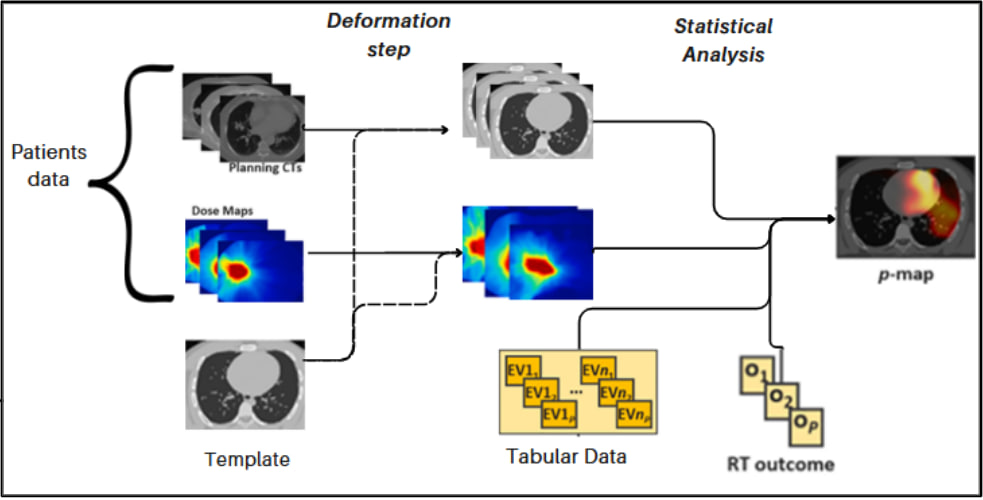
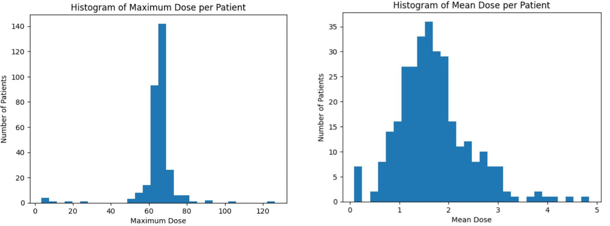

# 🫀 Voxel-Based Analysis and Clustering of Cardiac Regions in Lung Cancer Patients

This project explores the relationship between cardiac radiation dose and 2-year overall survival (OS) in stage 3 LA-NSCLC patients. Using **voxel-wise statistical modeling**, **unsupervised clustering**, and **advanced visualization**, we investigate spatial dose patterns in CT scans to identify regions most associated with survival outcomes.

---

## 🧠 Methodology Overview

This project follows a multi-stage analytical pipeline:
1. **Preprocessing** of DICOM/CT data
2. **Voxel-Based Analysis (VBA)** for statistical modeling
3. **Unsupervised Clustering** to identify spatial dose patterns
4. **Statistical Significance Testing** (e.g., Welch’s t-test, FDR correction)
5. **Visualization** of results for interpretation

---

## 📊 Key Visualizations

| Concept | Visualization |
|--------|----------------|
| **Dose Distribution Comparison** |  |
| **Voxel-Wise t-Map (OS 2y)** |  |
| **Outlier Detection (PCA/DBSCAN)** | |
| **Cluster Overlay on Template** | |

---

## 📂 Repository Structure
├── preprocessing/ # CT scan alignment, resampling, normalization
├── vba/ # Voxel-wise statistical mapping (e.g., t-tests, p-values)
├── clustering/ # PCA, DBSCAN, and spatial clustering scripts
├── visualization/ # Animated plots, overlays, and 3D maps
├── notebooks/ # Jupyter notebooks for exploration and reporting
├── visuals/ # GIFs and images for publication/presentation

---

## 🧬 Dataset

- **Source:** IRCCS Istituto Nazionale dei Tumori di Milano  
- **Patients:** 321 cases across 5 centers  
- **Modalities:** DICOM CT scans + RT dose maps  
- **Features:** Clinical, anatomical, therapy, comorbidity, outcome (2-year OS)

---

## 🧪 Statistical Tools Used

- Welch’s t-test (voxel-wise analysis)
- Benjamini–Hochberg FDR correction
- PCA & DBSCAN for outlier detection
- Mean dose voxel mapping

---

## 💡 Findings

- Survivors had more **focused** and **precise** dose distributions in heart regions
- Non-survivors showed **broader, less localized** exposure
- No single heart substructure showed consistent significant association across all patients
- Template alignment was crucial for meaningful voxel-wise comparisons

---

## 🚀 Goals

- Improve understanding of **cardiac toxicity** from radiotherapy
- Identify **spatial biomarkers** predictive of survival
- Support **personalized radiotherapy planning**

---

## 🏛️ Supervision

> This research was conducted under the mentorship of  
> **Fondazione IRCCS Istituto Nazionale dei Tumori di Milano**, Italy.

---

## 📜 Citation & Literature

- McWilliam et al., "Novel Methodology to Investigate the Effect of Radiation Dose to Heart Substructures on Overall Survival", *International Journal of Radiation Oncology*
- T. Rancati et al., “SLiC Algorithm for Spatial Dose Analysis”, *Journal of the European Society for Radiotherapy and Oncology*

---

## 🧠 Analysis Workflow

This diagram illustrates the full pipeline:
- **Input**: Patient CT scans and dose maps
- **Deformation Step**: All patient data is mapped to a common anatomical template
- **Statistical Analysis**: Voxel-wise comparisons between survivor groups
- **Output**: p-value maps indicating regions associated with 2-year survival

---

## 📊 Dose Distribution Statistics
## 📊 Dose Distributions & Outlier Detection

### 🔎 Summary

- **Two histograms** are shown above:
  - **Maximum Dose per Patient** (left)
  - **Mean Dose per Patient** (right)

- **Key statistical observations:**
  - For **non-zero dose values**, survivors have a voxel mean dose of approximately **1.83**, while non-survivors have a mean of **1.88**
  - The **percentage of zero dose values** is higher among survivors (**10.46%**) compared to non-survivors (**5.59%**)

> 🧠 **This suggests survivors tend to have more focused and precise dose distributions** than non-survivors.

---

### 🧪 Outlier Detection Methods

To detect abnormal patient dose patterns, **three methods** were applied:

- **PCA**: Principal Component Analysis based on voxel-level dose features  
  → Used projection on the first 2 components (97% of total variance)
- **DBSCAN**: Density-based spatial clustering
- **Mean of pairwise distances**: To detect spread within voxel dose distributions

---

### 🚨 Identified Outliers

**5 patients were classified as outliers** by at least 2 of the above methods:

| Patient ID | Survival | Notes               |
|------------|----------|---------------------|
| #61        | No       | Far from template   |
| #164       | Yes      | Close to template   |
| #197       | Yes      | Close to template   |
| #199       | Yes      | Close to template   |
| #258       | No       | Close to template   |

> These cases highlight that **non-survivors may have less spatial consistency**, while survivors tend to cluster more tightly around a shared dose pattern.

---

## 🌐 Spatial Clustering Result

- **3D voxel cluster plot** of significant regions (labeled by color)
- Generated using spatial clustering after thresholding voxel-wise p-values
- Clusters **39, 42, 46, 47** show distinct spatial behavior within heart region

---

