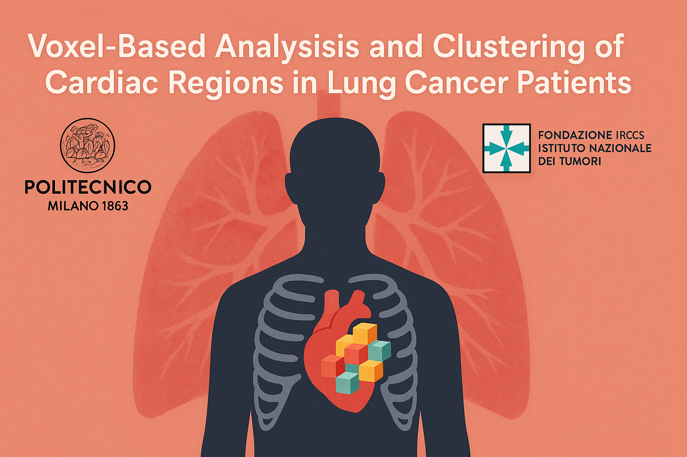
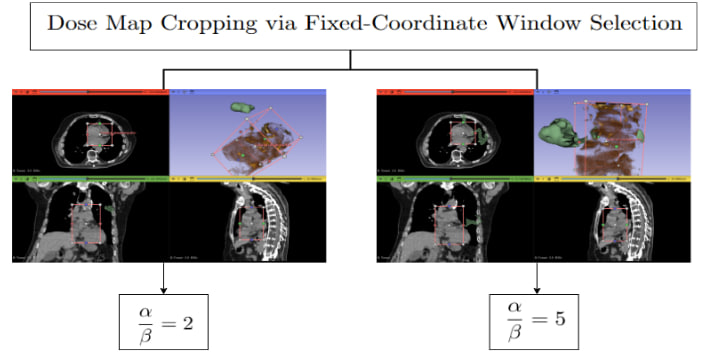

  

Lung cancer is one of the most frequent and deadliest cancers. The **5-year overall survival rate** is approximately **25%**.  
Among these patients, many are diagnosed with **locally advanced stage 3 NSCLC (LA-NSCLC)**, for which **radiation therapy (RT)** is a primary treatment modality.
This project explores the relationship between cardiac radiation dose and 2-year overall survival (OS) in stage 3 LA-NSCLC patients. Using **voxel-wise statistical modeling**, **unsupervised clustering**, and **advanced visualization**, we investigate spatial dose patterns in CT scans to identify regions most associated with survival outcomes.

---
### ⚠️  Research Challenge

Radiotherapy involves directing high-energy beams at the tumor to:
- **Maximize dose** to cancer cells
- **Minimize dose** to nearby healthy tissue

However, **higher radiation doses** to the tumor area may also affect surrounding structures — especially the **heart and large vessels** — leading to increased **treatment-related mortality**.  
One key hypothesis is that **RT dose to specific cardiac regions** may be a contributing factor in reduced overall survival.

---

## 🧬 Dataset Description

- **Source:** IRCCS Istituto Nazionale dei Tumori di Milano  
- **Patients:** 321 cases across 5 centers  
- **Modalities:** DICOM CT scans + RT dose maps  
- **Features:** Clinical, anatomical, therapy, comorbidity, outcome (2-year OS)
- **Data types:** DICOM CT scans, dose distributions, and 54 patient-level features, grouped as follows:
  - 🔹 Anatomic and Metabolic Features
      -  Age, sex, height, weight, BMI
      - Hypertension, KPS (Karnofsky Performance Status)
      - Smoking status
      - Medications
      - Clinical parameters
  - 🔹 Cancer-Related Features
      - Stage of cancer
      - Genetic mutations
      - Tumor dimensions
      - Site of primary tumor
  - 🔹 Drug and Therapy Features
      - Chemotherapy cycles
      - Immunotherapy status
      - Start time of RT
      - Type of RT machine used
      - EQD2 prescription dose
      - Volume targeted by RT
  - 🔹 Disease and Outcome Features
      - Overall survival at 2 years
      - Pulmonary events
      - Cardiac events post-radiotherapy
---
## 🧪 Feature Engineering & Preprocessing

- **Medications**: Combined into categories  
  `Diabetes`, `Antilipidic`, `Beta-Blockers`, `Diuretics`, `Antithrombotic`, `Hypertension`  
  → Coded as: `0`, `1`, `2`, `>3` (total count)

- **Therapy Types**:  
  `Target Therapy + Immunotherapy (combined)`  
  `Others_pb = Mediastino + N (combined)`

- **Smoking Status**:  
  Binary encoded

- **KPS (Performance Status)**:  
  Grouped into three classes: `<=80`, `90`, `100`

- **Chemotherapy Schedule**:  
  Rescaled, with `0` indicating "no chemotherapy"

---

## 🧪 Statistical Tools Used

- Welch’s t-test (voxel-wise analysis)
- Benjamini–Hochberg FDR correction
- PCA & DBSCAN for outlier detection
- Mean dose voxel mapping

---

## 🧠 Methodology Overview

This project follows a multi-stage analytical pipeline:
1. **Preprocessing** of DICOM/CT data
2. **Voxel-Based Analysis (VBA)** for statistical modeling
3. **Unsupervised Clustering** to identify spatial dose patterns
4. **Statistical Significance Testing** (e.g., Welch’s t-test, FDR correction)
5. **Visualization** of results for interpretation

---
## 🧠 Analysis Workflow

This diagram illustrates the full pipeline:
- **Input**: Patient CT scans and dose maps
- **Deformation Step**: All patient data is mapped to a common anatomical template
- **Statistical Analysis**: Voxel-wise comparisons between survivor groups
- **Output**: p-value maps indicating regions associated with 2-year survival

---

## 📊 Key Visualizations

| Concept | Visualization |
|--------|----------------|
| **Raw Data** | 

 |
| **Dose Distribution Comparison** | 

 A quick animation showing different dose maps among patients.   It visually demonstrates the spread and variation of radiation across individuals. |
| **Voxel-Wise Group Dose Characteristics** | 

 Boxplots and histograms compare survivors (YES) and non-survivors (NO) for:   ▫️ % of zero-dose voxels   ▫️ Mean dose of non-zero voxels   👉 Survivors tend to have more voxels spared and more focused dosing. |
| **Axial Dose Distribution Map** | 

 Heatmaps of mean dose across an axial slice:   ▫️ Right side of lung   ▫️ Left side of lung   Indicates spatial asymmetry in dose distribution. |
| **Cropping by ROI** | 
 
 Manual cropping of 3D dose maps using a fixed coordinate window, applied consistently across patients.   This prepares the data for spatial analysis using the following radiobiological normalization:  

 ☢️ The **EQD₂ formula** adjusts physical dose (D) using a **biological weighting factor**, based on the linear-quadratic model with tissue-specific **α/β** ratios.   ▫️ Two settings were applied: α/β = 2 (for late-responding tissues) and α/β = 5 (intermediate case). |
| **Spatial Clustering Result** | 

 **3D voxel cluster plot** showing statistically significant regions (colored labels).   ▫️ Clustering was applied after thresholding voxel-wise p-values   ▫️ Labels **39, 42, 46, 47** show spatial coherence across the heart region, pointing to potential anatomical biomarkers. |
| **Dose Distribution & Outlier Detection Summary** | 

 **Histograms of Maximum and Mean Dose per Patient**: Survivors: mean dose ≈ **1.83**, higher % of zero-dose voxels (**10.46%**) ; Non-survivors: mean dose ≈ **1.88**, lower % of zero-dose voxels (**5.59%**) Indicates survivors may receive more focused dosing. |

---

## 💡 Findings

- Survivors had more **focused** and **precise** dose distributions in heart regions
- Non-survivors showed **broader, less localized** exposure
- No single heart substructure showed consistent significant association across all patients
- Template alignment was crucial for meaningful voxel-wise comparisons

---

## 🚀 Goals

- Improve understanding of **cardiac toxicity** from radiotherapy
- Identify **spatial biomarkers** predictive of survival
- Support **personalized radiotherapy planning**

---
## 🎓 Academic Affiliation

This project was developed as part of the **Applied Statistics** course at  
**Politecnico di Milano** (*PoliMi*), Italy  
**Course Instructor**: Prof. Piercesare Secchi  
**Lab Supervisor**: Ing. Guillaume Koechlin
### 🧑‍🔬 Project Team

🎓 **Students**:  
- Stefano Beraldo  
- **Darkhan Islam**  
- Amine Ould Hocine  
- Samuel Povoa  

📡 **Supervised by**:  
- Alessandra Catalano  
- Alessandro Cecchetti  

> This research was conducted under the mentorship of  
> [**Fondazione IRCCS Istituto Nazionale dei Tumori**](https://www.istitutotumori.mi.it/istituto-nazionale-dei-tumori) , Milano, Italy.

📚 *Applied Statistics Research Collaboration*

---

## 📜 Citation & Literature

- [McWilliam et al., "Novel Methodology to Investigate the Effect of Radiation Dose to Heart Substructures on Overall Survival"](https://pubmed.ncbi.nlm.nih.gov/32585334/)
- T. Rancati et al., “SLiC Algorithm for Spatial Dose Analysis”, *Journal of the European Society for Radiotherapy and Oncology*

---

